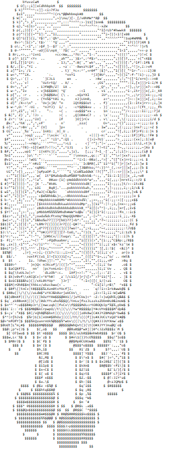
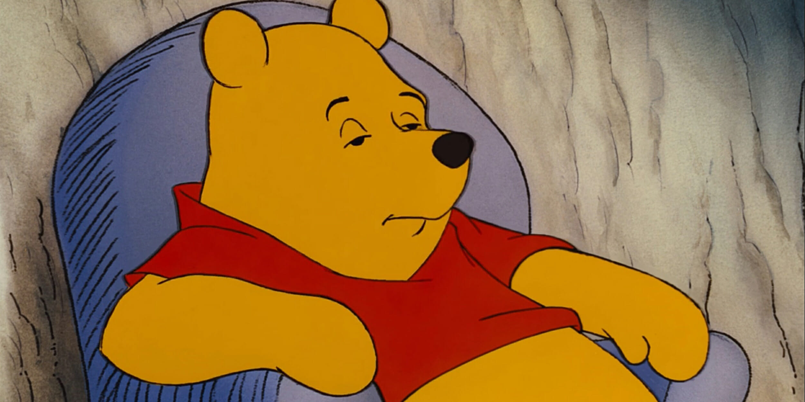
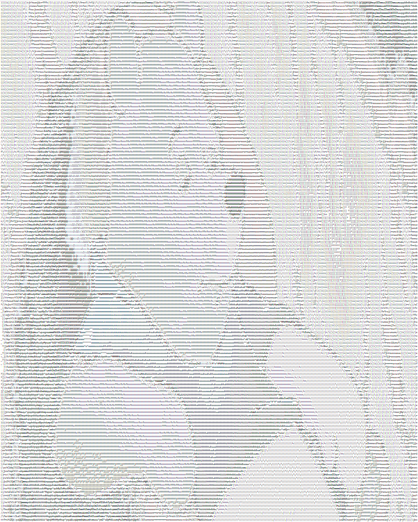

# image-to-ascii
This program takes the provided png or jpeg file and outputs it on the command line as ASCII art.

## Usage
Acquire the `ascii` executable by downloading it or by compiling `ascii.go` with `go build ascii.go`.
To use the `ascii` executable:
```
 ./ascii -image [file name] -width [int] -height [int]
    -image [string]
        Required: the path of the image to turn into ASCII art.
    -width [int]
        The width of the resulting ASCII art. (default 80)
   -height [int]
        The height of the resulting ASCII art. (default 0)
  ```      
  If either width or height (but not both) is set to 0, the resulting ASCII art will be scaled to be in the original ratio.
  
  ## Automatically Scales Image
  This tool automatically scales your image so the width is 80 characters because that's the size of a standard terminal window. If you want to change the dimensions of your ✨magnificent✨ artwork, use the `-width` and `-height` flags.

  ## Image Formats
  This tool only supports png and jpg images.

  ## Examples
  `./ascii -image spongebob.png` </br>
  
  

  `./ascii -image winnie.jpg -width 300` </br>
  
  

  ## Next Steps
  I might turn this into a website if there's any interest in it/if I have the time.

  ## Acknowledgements
  Thanks to Github user [nfnt](https://github.com/nfnt) for creating [the resize package](https://github.com/nfnt/resize) used in this tool.